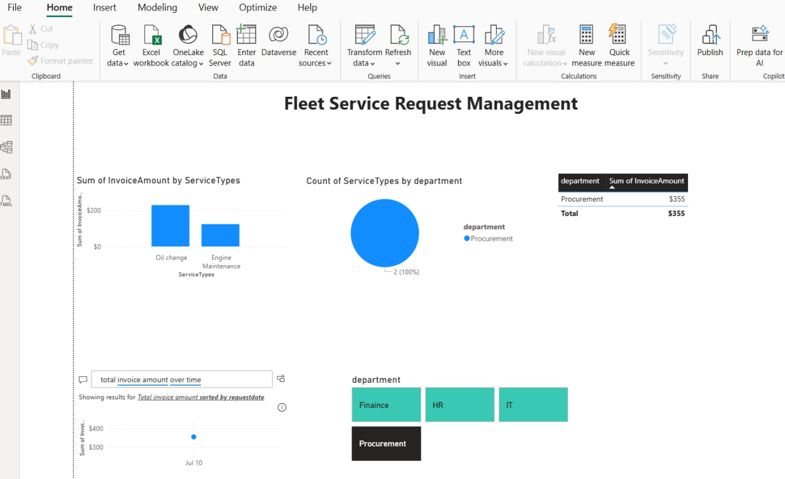

# Fleet Service Request Management – Power Apps + SharePoint Solution

## Overview
The Fleet Service Request Management app is a Power Apps + SharePoint solution designed to automate fleet service requests, supervisor approvals, and procurement notifications.  
It reduces manual processing, improves data accuracy, and provides management with actionable insights through Power BI dashboards.

---

## My Role
- Designed SharePoint lists to track service requests, vehicles, and approvals  
- Built the Power Apps interface for request submission and management  
- Created automated Power Automate workflows for supervisor approvals, notifications, and follow-ups  
- Integrated Active Directory to eliminate manual requester entry and improve data accuracy  
- Built Power BI dashboards to monitor request status, approval times, and procurement performance  
- Collaborated with project managers, procurement teams, and stakeholders for requirements and testing  

---

## Tools & Technologies
- **Power Apps** (Canvas App)  
- **Power Automate** (Workflows & notifications)  
- **SharePoint Online** (Lists, permissions, data structure)  
- **Power BI** (Management dashboards for decision-making)  
- **Microsoft 365** (Teams, Outlook for integrated notifications)  

---

## Key Features
- Submit and track fleet service requests  
- Multi-stage supervisor approvals  
- Automatic notifications to procurement and requesters  
- AD integration to eliminate manual entry  
- Power BI dashboards for management decision-making, including request status, approval times, and team performance  

---

## Key Metrics & Impact
- Reduced supervisor approval turnaround time by **40%**  
- Cut manual email processing by **60%**  
- Improved requester data accuracy by **~30%**  
- Reduced procurement follow-up delays by **50%**  
- Management can make faster decisions using real-time Power BI dashboards  

---

## Screenshots

  
  
  
  
*Power BI dashboard showing request status, approval times, and procurement performance.*

